```{r echo=FALSE}
yml_content <- yaml::read_yaml("chapterauthors.yml")
author <- yml_content[["overlay-analysis-caribou"]][["author"]]
```

# Spatial Overlay in QGIS {#overlay-analysis-caribou}

Written by
```{r results='asis', echo=FALSE}
cat(author)
```

## Lab Overview {.unnumbered}

Caribou are a keystone species in BC, and their presence indicates the health of boreal and mountain ecosystems. Habitat loss due to logging, mining, and climate change has led to significant population declines. Protecting caribou habitats helps preserve these ecosystems, supports the species' recovery, and protects important ecological services and cultural values.

In this lab you will practice using overlay tools in QGIS to explore caribou habitat availability in BC. You will learn about Structured Query Language (SQL) and perform a table and spatial join in QGIS.

------------------------------------------------------------------------

### Learning Objectives {.unnumbered}

-   Become familiar with spatial overlay tools in QGIS
-   Use Structured Query Language (SQL) to select features based on their attributes.

------------------------------------------------------------------------

### Deliverables {.unnumbered}

-   Answers to questions posed in the lab handout

------------------------------------------------------------------------

## Task 1: Import Data {.unnumbered}

This lab introduces a new **open-source** software called **QGIS**. It has similar tools and operations as ArcGIS Pro, (which you used in the first two labs), but it is freely available to the public and does not require a paid subscription like ArcGIS Pro. Many consulting and NGO's prefer QGIS for this reason, so it is helpful to be familiar with how to use it!  

**Step 1:** Open QGIS and select "New Empty Project". To add data to the map use the **Browser** pane on the left to navigate to the directory on your computer where the lab data is saved. Your "Downloads" and "Documents" folders will be listed under the **Home** directory in the Browser. Double click on a layer to add it to the map. 

Load the **Herds.fgb** and the **Herd_area_forest.csv** datasets. The "flatgeobuf" or ```fgb``` is a new spatial data file type, it is equivalent to a shapefile that we worked with in ArcGIS, but it is open-access and is not "owned" by ESRI (the company the makes ArcGIS). Also note that the Herd_area_forest dataset is not a spatial data set (it is just a table of attributes) - so it will not add spatial data on the map. 

```{r 03-qgis, out.width= "100%", echo = FALSE}
    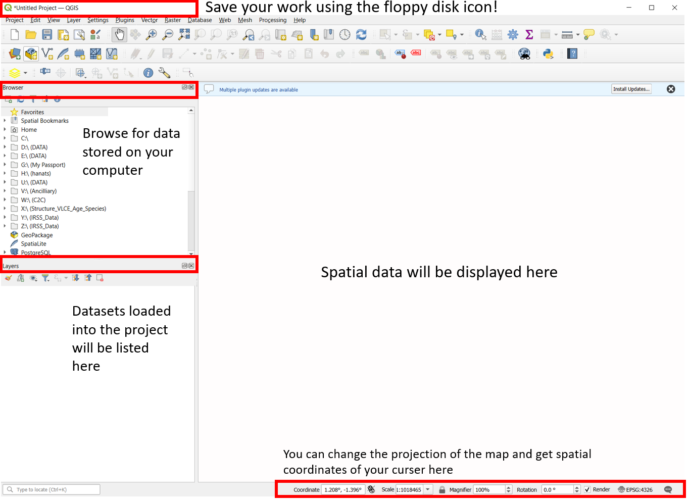
```

If you ever accidentally close the Browser or Layers panels you can reopen them from View > Panels > and toggling on the visible panels! 

**Step 2:** Add a basemap by scrolling through the Browser panel and double clicking on **Open Street Map**. You may get a pop-up window asking which geographic transformation you want to apply to the basemap. Click the first one on the list > Okay. 
In the Layers panel you can change the order the layers plot in by dragging and re-ordering them. Put the basemap on the bottom and the herd layer on top. Practice zooming in and out and panning on the map.  

```{r 03-basemap, out.width= "40%", echo = FALSE}
    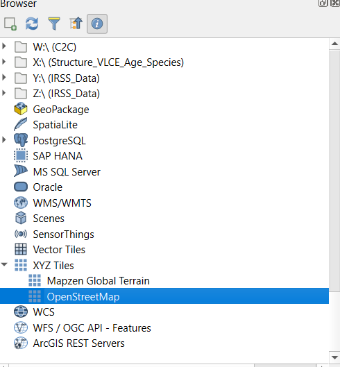
```

**Step 3:** Open the **Herds** attribute table by right-clicking on it in the Layers panel > Open Attribute Table. Each polygon in this layer represents the range of a caribou herd. You can see attributes for things like the herd name, ecotype and risk status. 

```{r 03-holc_att, out.width= "100%", echo = FALSE}
    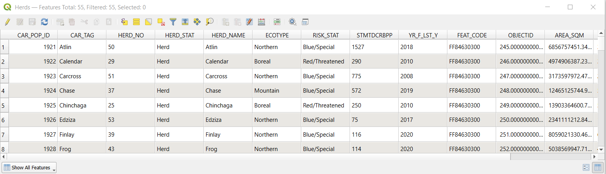
```

#### Q1) How many unique herds are there in BC? {.unnumbered}

**Step 4:** Next, symbolize the herds by risk status. Right click on the Herds layer > Properties > Symbology. hange the symbology type to "Categorized" and the value field to "RISK_STAT". Click the "Classify" button to add the classes to the legend and adjust the colors as you see fit > OK.  

```{r 03-holc_class, out.width= "90%", echo = FALSE}
    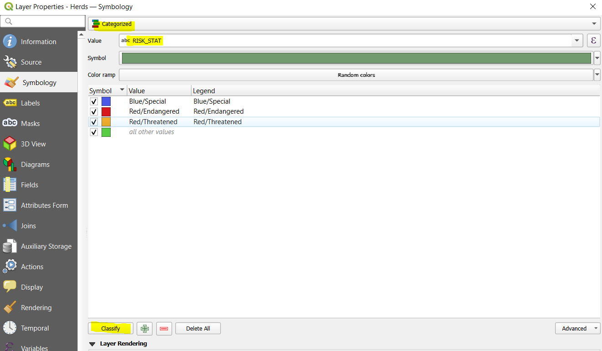
```

Your map should look something like the following: 

```{r 03-task1map, out.width= "90%", echo = FALSE}
    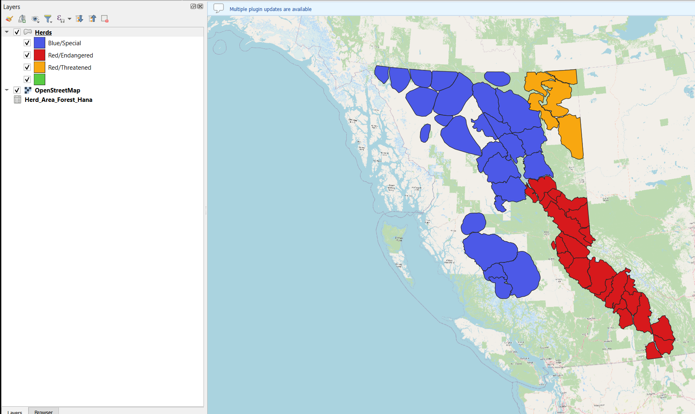
```

**Step 5:** Right-click on the Herds layer and navigate to **Information** in the Properties tab to answer the following questions:

#### Q2) What is the coordinate system of the data? {.unnumbered}

#### Q3) How many attributes (or fields) are in the dataset? How many attributes are a numeric data type? {.unnumbered}

------------------------------------------------------------------------

## Task 2: Join Tables {.unnumbered}

In this task we will join attributes from a table represented forested area to the Herds polygons. 

**Step 1:** Right-click on the **Herd_Area_Forest** layer and open the attribute table. The attribute "Forest Area(Sqm)" represents the area of forests in m2 within each herd polygon. To perform a tabular join the two datasets both need to have a common attribute, or "key". A "key, indicates which rows from the first data set correspond to the rows in the second dataset. Rows that have the same value in the "key" will be joined together. In this case we will join the non-spatial tabular forested areas data to the herd polygons.  

Inspect the attribute tables of the **Herd_area_forest** and **Herd** polygons.

#### Q4) What attribute could we use as a key to join these two datasets together? {.unnumbered}   

**Step 2:** To perform a tabular join on the top ribbon navigate to Processing > Toolbox > Search for "join attributes by field value". 

- Input Layer: **Herds**
- Table field: [input the key attribute from Q4 here]
- Input Layer 2: **Herd_area_forest**
- Table field: [key attribute]
- Join type: Take attributes of the first matching feature only
- **Run**

You should now see a new layer in the contents pane called "Joined layer". Open the attribute table and scroll through all the attributes - the information from the forested area dataset should be joined to each polygon feature.  

------------------------------------------------------------------------

## Task 3: Select Features Using SQL statements {.unnumbered}

The SQL statement is widely used in GIS to select target features. There are four basic conditional operators (i.e., Boolean operators): AND, OR, XOR, and NOT. Similar to the Set concept in mathematics.

**AND** is an exclusive statement that needs the selected feature to meet both or multiple criteria to be passed. The tuple illustration for A AND B is listed below.

```{r 03-and, out.width= "40%", echo = FALSE}
    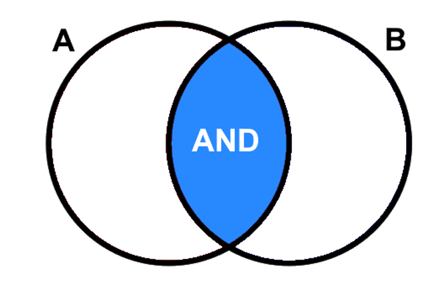
```

**OR** is an inclusive statement that will select all the features that meet any one of the criteria. As outlined in the shaded blue tuple, all the features that fall within this area will be selected (A OR B).

```{r 03-or, out.width= "40%", echo = FALSE}
    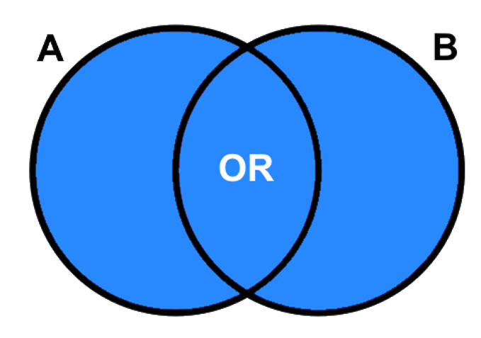
```

**NOT** is an exclusive statement. It is used to diminish the range of one desired characteristic. The tuple illustration for A NOT B is shown below.

```{r 03-not, out.width= "40%", echo = FALSE}
    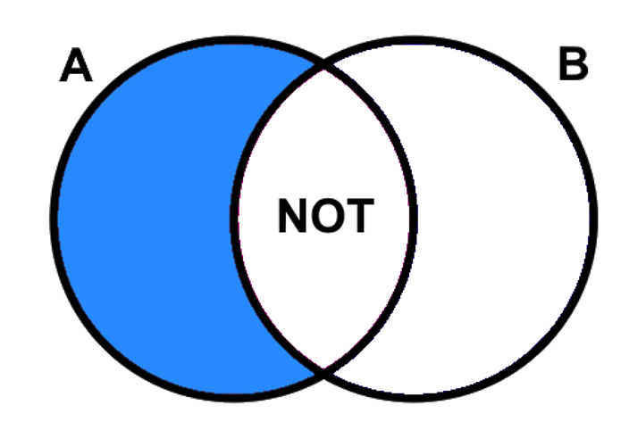
```

**XOR** is used to describe a relationship to exclude the common area in two tuples, but the areas that are true individually for both or multiple statements will be kept. (i.e. everthing but the intersection of A and B). 

```{r 03-xor, out.width= "40%", echo = FALSE}
    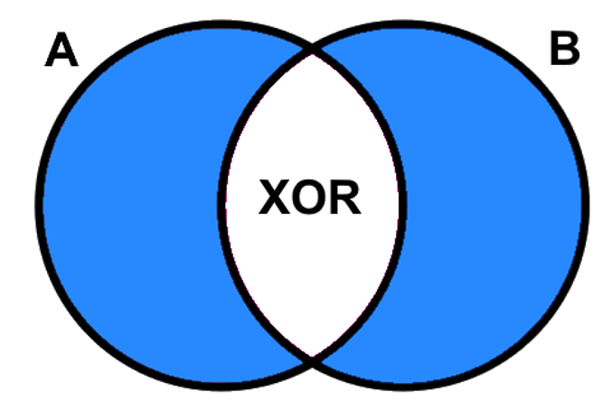
```

**Step 1:** Open the attribute table of the "Joined layer" polygon and click the "Select by Expression" button. (If you have closed QGIS between this task and the previous task you may need to repeat the join operation with the forested area table).

```{r 03-exp, out.width= "80%", echo = FALSE}
    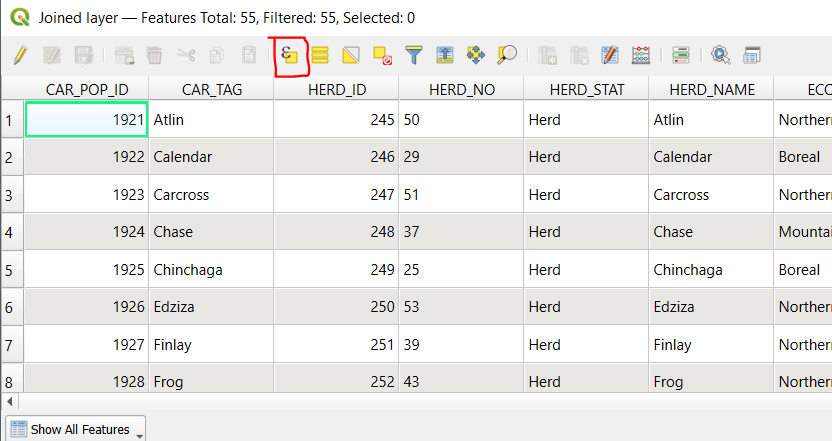
```

We will practice some basic queries using the attributes in the table. You can directly type a selection query into the Expression panel on the right or you can use the drop-down menus on the left to help build your queries. 

**Step 2:** First, we will select the features where the RISK_STAT attribute is 'Blue/Special'. Expand the "Fields and Values" menu. Double click the RISK_STAT attribute - this will add it to the expression box on the left. Use the = sign button on the bottom (or type in in) to add  the symbol to the expression. Finally, click the "All Unique" button to see the unique values of the RISK_STAT attribute and click *Blue/Special*. You should now see the completed expression on the left. > **Select Features**. The selected features should be highlighted in yellow on the map.  

```{r 03-query, out.width= "80%", echo = FALSE}
    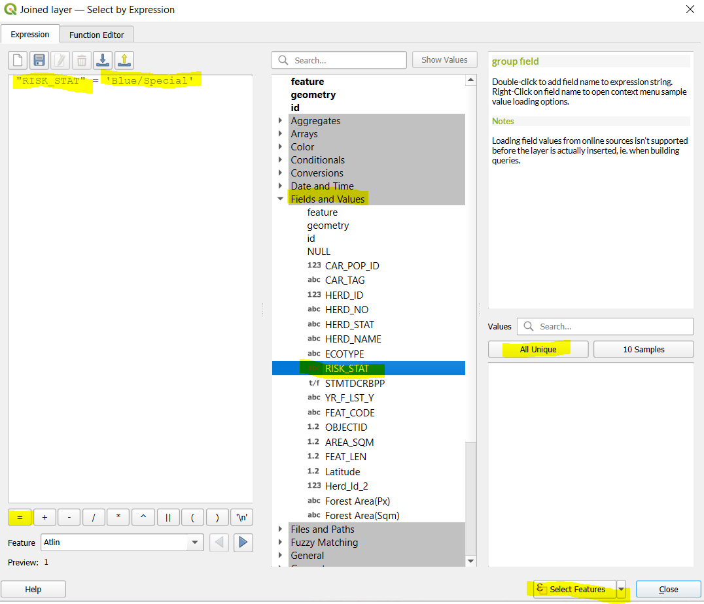
```

Notice the formatting style of the expression - the attribute RISK_STAT is enclosed in " " and the field value is enclosed in ' '. SQL statements must follow these formatting rules, otherwise you will get an error when you try and run the query. You can use the drop-down menus to select attributes, operators and values which will automatically apply the formatting for you. 

**Step 3:** Open the attribute table of "Joined layer" and notice that **26** polygons with 'Blue/Special' are highlighted. 

```{r 03-selected, out.width= "80%", echo = FALSE}
    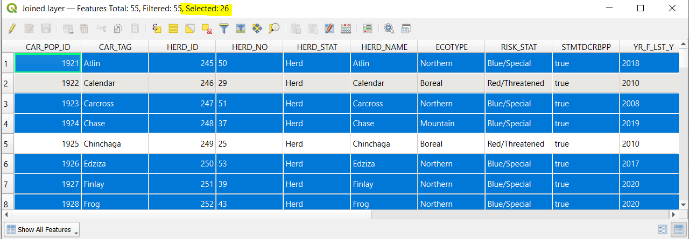
```

Clear the selected features. Repeat the same query but this time use the "NOT EQUAL" operator ```!=```. Now 29 polygons should be selected. 

```{r 03-clear, out.width= "80%", echo = FALSE}
    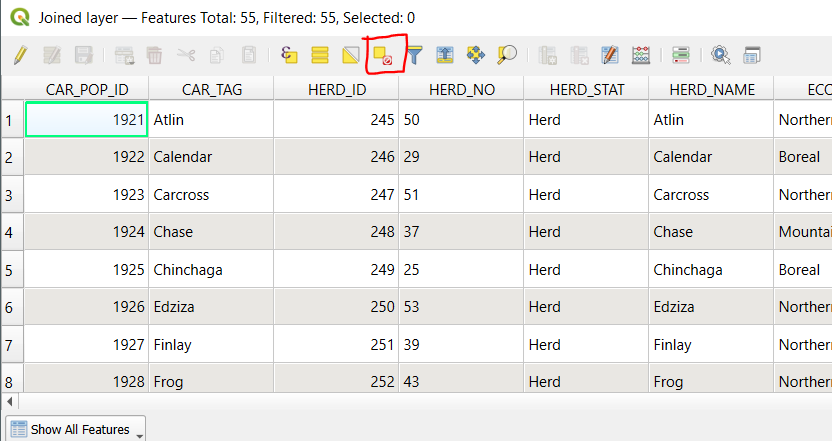
```

**Step 4:** Now we will combine two attributes in a query using the boolean (AND/OR/NOT) operators. Practice using the drop-down menus and typing directly into the expression panel to construct the following SQL statement:  ``` "RISK_STAT"  =  'Blue/Special'  AND  "Forest Area(Sqm)" > 3000000000```. (The AND operator and the > symbol can be found in the "Operators" drop-down menu below "Fields and Values".)

#### Q5: How many polygons are selected with this query? {.unnumbered}

Clear the selected attributes. 

**Step 5:** Use what you have learned about SQL statements to answer the following questions:

#### Q6: How many herds are Endangered or Threatened? Include the SQL statement. (Hint: you will need to use the "RISK_STAT" attribute twice in your SQL statement) {.unnumbered}

#### Q7: How many herds with the Mountain ecotype are classified as Endangered? Include the SQL statement. {.unnumbered}

#### Q8: List the names of the herds in the Boreal ecotype with **between** 1000000000 and 5000000000 Sqm of forested area? Include the SQL statement. {.unnumbered} 

#### Q9: How many herds have at least 5000000000 Sqm of forested area but are **NOT** Endangered or Threatened? Include the SQL statement. {.unnumbered} 

------------------------------------------------------------------------

## Task 4: Data Analysis {.unnumbered}

In this task we will combine the herd polygons with spatial information of wildfire boundaries to understand which herds have experienced the most disturbance from wildfire. 

**Step 1:** Load the wild fires polygon shapefile from **Lab 2** (H_FIRE_PLY) and plot it on top of the caribou herds. 

```{r 03-fires, out.width= "80%", echo = FALSE}
    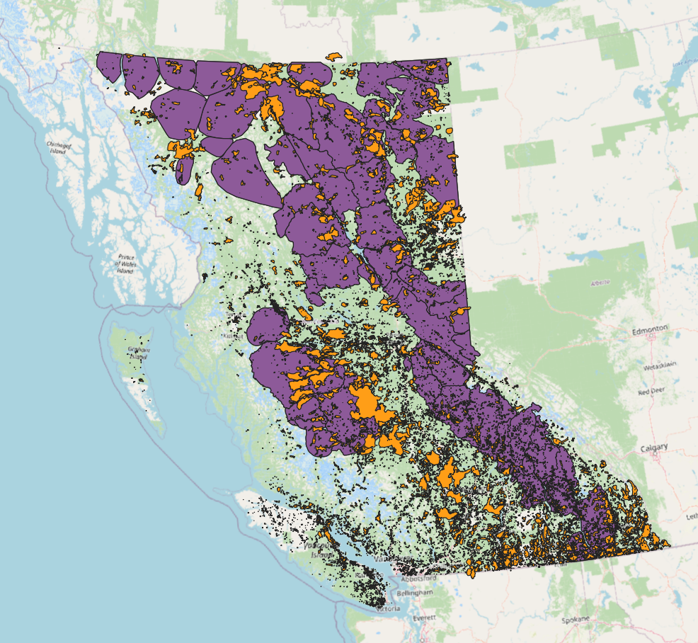
```

**Step 2:** We will use the **Intersection** tool to extract the overlapping area between the caribou herd boundaries and wildfire extents. The resulting layer will have attributes from both input layers. 

```{r 03-intersect, out.width= "80%", echo = FALSE}
    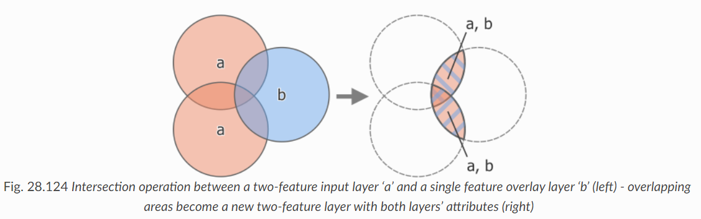
```
https://docs.qgis.org/3.34/en/docs/user_manual/processing_algs/qgis/vectoroverlay.html

Search for the **Intersection** tool, Processing > Processing Toolbox. 

- Input Layer: Herds
- Overlay Layer: H_FIRE_PLY
- Leave defaults for all other options
- Hit Run. This operation may take several minutes. 

**You will encounter the following error message ```Feature (16748) from “H_FIRE_PLY_polygon” has invalid geometry. Please fix the geometry```. To do this, navigate to the "Fix Geometries" tool in the Processing Toolbox and use the "H_FIRE_PLY" layer as the input.**

Now try re-running the Intersection tool using the resulting "Fixed geometries" layer. 

At the end you should have a new layer called "Intersection". Turn off all other layers and inspect the output and its attribute table. Each polygon represents the area within the the caribou herds that **also** experienced fire. 

**Notice that there are some attributes with duplicate names in both datasets (for example AREA_SQM and AREA_SQM2). The attributes from the caribou herds will be listed first and the attributes from the fire polygons will be listed second!**

**Step 3:** Next we will calculate the area in km2 of each of the intersected polygons. Open the attribute table of the **Intersection layer** we just created. 

Click the "Field Calculator" button (it looks like an abacus). 

We will use the $area command to calculate the area of each polygon - note that the default units are meters squared so we will divide by 1000000 to get km squared. 

- Output field name: ```intersect_area_km```
- Output filed type: Decimal Number (real)
- Output field length: 10
- Precision: 3
- In the Expression panel type: ```$area / 1000000```
- Click OK.

```{r 03-field, out.width= "80%", echo = FALSE}
    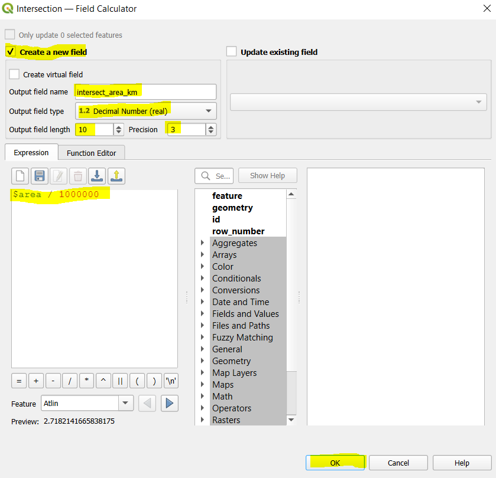
```

Click the "Save edits" button on the Intersection attribute table to save the new field. 

```{r 03-save, out.width= "80%", echo = FALSE}
    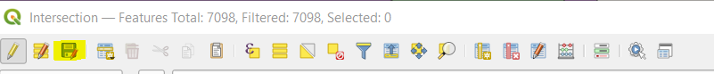
```

**Step 4:** On the top ribbon click View > Statistical Summary to open the Statistics panel. We can use this tool to calculate summary statistics including the sum, mean, max and range for the features in our dataset. 

Change the input layer to "Intersection" and the attribute to "intersect_area_km". You should now see summary statistics of the "intersect_area_km" field for all polygons in the dataset. 

```{r 03-stats, out.width= "50%", echo = FALSE}
    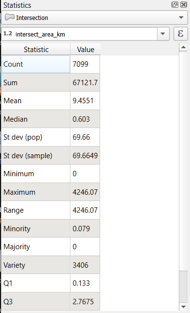
```

#### Q10: What is the total burned area within caribou herd ranges (report in km squared)? {.unnumbered} 

**Step 5:** At the bottom of the Statistics panel check the "Selected features only" box. Open the "Intersection" attribute table and use the "Select by Expression" tool from previous Task to select polygons in the "Northern" herd ECOTYPE. The summary statistics should automatically update for the selected polygons. 

#### Q11: What is the total burned area in the Northern herd ecotype? {.unnumbered} 

**Step 6:** Use what you have learned about SQL statements and summary statistics to answer the following questions:

#### Q12: What is the total area of Endangered caribou habitat in km squared? (Total HABITAT not burned area!) {.unnumbered}

#### Q13: What is the total burned area of Endangered caribou habitat in km squared? {.unnumbered}

#### Q14: What **proportion** of Endangered caribou habitat was burned? Answer to 3 decimal places. {.unnumbered}