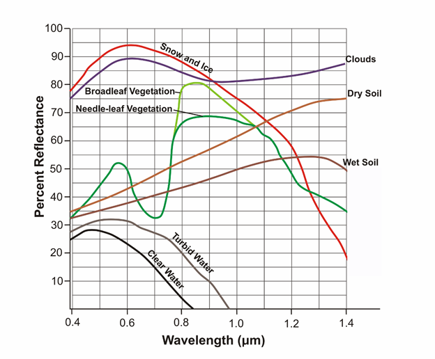

---
output:
  word_document: default
  html_document: default
---
```{r echo=FALSE}
yml_content <- yaml::read_yaml("chapterauthors.yml")
author <- yml_content[["lab5shortname"]][["author"]]
```

# Remote Sensing Imagery Analysis {#RS-imagery}

Written by

```{r results='asis', echo=FALSE}
cat(author)
```

## Lab Overview {.unnumbered}

The aim of this lab is to learn about the electromagnetic spectrum (EMS), understand spectral properties of different surfaces, and get comfortable using ArcGIS Pro to load and explore different types of remotely sensed images, display individual spectral bands, make different colour composites, and view spectral signatures. In addition, you will calculate two difference spectral indices representing built up areas and green vegetation.

------------------------------------------------------------------------

### Learning Objectives {.unnumbered}

-   Understand the electromagnetic spectrum
-   Use Landsat 5 spectral reflectance to map vegetation and urban areas 
-   Analyze spectral signatures of different land cover types

------------------------------------------------------------------------

### Deliverables {.unnumbered}

- Answers to 17 questions throughout the handout
- A map of reclassified urban/vegetated land cover

------------------------------------------------------------------------

### Data {.unnumbered}

We will be working with a multispectral image of Vancouver from the Landsat 5 satellite **(L5057026subset_19990922_7B.dat).**

------------------------------------------------------------------------

## Task 1: The EMS {.unnumbered}

The **electromagnetic spectrum (EMS)** is the distribution of electromagnetic radiation according to wavelength/frequency, and includes radio waves, visible and infrared light, x-rays, gamma rays, and more. In remote sensing, we use the reflective, absorptive, and emissive properties of terrestrial features to identify and measure them (i.e. how do different wavelengths in the EMS interact with the surface of the Earth?).

Note: It is important to recognize that the **visible** part of the EMS is the only section that humans can see. ***All colours in the visible spectrum are wavelengths, but not all wavelengths in the EMS are colours.***

**Spectral Reflectance**

Figure 1 shows the reflective characteristics of various features of the earth's surface. Use this figure to answer **Q1 -- Q4.**

```{r 05-em, out.width= "60%", echo = FALSE}
    
```

Figure 1: Reflectance characteristics of various features at different wavelengths.

##### Q1. For broadleaf and needle-leaf vegetation, what is the approximate wavelength that is reflected most, and what section of the ems does this range belong to?? {.unnumbered}

##### Q2. TRUE/FALSE. Do soil and vegetation reflect roughly the same proportion of blue light. {.unnumbered}

##### Q3. Give a wavelength (in microns) at which snow and ice, dry soil, and vegetation are indistinguishable by their reflectance. In other words, at which wavelength is the proportion of radiation reflected the same (+/- 10%) for these features? {.unnumbered}

##### Q4. Broadleaf and needle leaf vegetation reflect the same amount at 0.7 microns. What causes this? Is there something contained in the foliage of both types of vegetation which causes identical spectral signatures? How does this pattern in spectral reflectance affect how we see live vegetation? {.unnumbered}

```{r 05-em2, out.width= "60%", echo = FALSE}
    knitr::include_graphics("images/05/05-em2.png")
```

Figure 2: Reflectance characteristics of unknown features.

##### Q5. Figure 2 contains 4 additional spectra, belonging to unknown surface features. Hypothesize about what these spectra might be and provide your reasoning. Use the known features (broadleaf vegetation, wet soil, etc.) and what you have learned from class/readings to inform your choices. This is a difficult task, and educated guesses are all that is asked for. Do a bit of research, put some thought into it, and explain the reasoning for your guesses. These spectra do not represent the features which are already labeled. You must think of new features which could be observed with remote sensing. {.unnumbered}

------------------------------------------------------------------------

## Task 2: Landsat 5 Bands, the EMS & ArcPro Software  {.unnumbered}

Table 2: Parameters of Landsat 5’s Enhanced Thematic Mapper (ETM+) sensor

```{r echo = FALSE}
Band = 1:7
wl = c('0.45-0.52', '0.52-0.60', '0.63-0.69', '0.76-0.90', '1.55-1.75', '10.40-12.50', '2.08-2.35')
sp = c('Blue', 'Green', 'Red', 'Near Infrared', 'Middle Infrared', 'Thermal Infrared', 'Middle Infrared')
r = c(30, 0, 30 ,3 ,30 ,60, 30)
app = c('Coastal water mapping, differentiation of vegetation and soils.', 'Assessment of vegetation vigor.', 'Chlorophyll absorption for vegetation differentiation.', 'Biomass surveys and delineation of water bodies', 'Vegetation and soil moisture measurements. Differentiation of ice and clouds.', 'Thermal mapping, soil moisture studies, plant heat stress measurement', 'Hydrothermal mapping')

df = data.frame(Band, wl, sp, r, app)
colnames(df) <- c('Band', 'Wavelength Range (microns)', 'Spectral Region', 'Spatial Resolution (meters)', 'Applications')

library(knitr)
kable(df, align = 'c')

```
 
##### Q6: Each pixel of landsat’s thermal infrared band (band 6) covers ___ pixels of the other bands. If it helps, draw a picture of the two pixel resolutions. {.unnumbered}

##### Q7: Band 6 is recorded with a coarser resolution because thermal radiation has a very ___ wavelength. Therefore, there is ___ energy available to sense. {.unnumbered}

**Step 1: Starting ArcGISPro**

To start the lab, Open a new ArcPro map project and open the the L5057026subset_19990922_7B.dat  file into the map window. At this point, you should see an RGB satellite image of the city of Vancouver (Figure 3) if the mapview does not immediately pan to the image right click **L5057026subset_19990922_7B.dat**  in the Contents pane and press Zoom to Layer .  

```{r 05-sat, out.width= "75%", echo = FALSE}
    knitr::include_graphics("images/05/05-sat.png")
```

Figure 3: True colour composite of Vancouver. 

**Step 2: Exploring the data**

It is now time to explore your imagery. Right click the box beside the **L5057026subset_19990922_7B.dat**  file in the Contents pane and select “Properties”. Use the menu on the left-hand side and select the Source page and the Raster Information drop down. 

```{r 05-source, out.width= "75%", echo = FALSE}
    knitr::include_graphics("images/05/05-source.png")
```

After clicking on the Raster Information, the tab should open up, and display important information about the image, such as dimensions (number of pixels in the X or Y directions), data types, projection, and resolution (listed as Projection/Pixel). This information can be useful when examining an image!

From the **Raster Information**  you can see that the spatial resolution of this image is approximately 30 m by 30 m, square. That means that each pixel in the image represents an area of approximately 30 x 30 m on the ground, or 900 square meters. Furthermore, it is a Landsat 5 Thematic Mapper image of Vancouver and its surroundings taken at 22 September 1999 - Wow! Even more details are apparent – its size is 4000 by 3000 pixels, and has seven bands.

Scroll down and press on the **Spatial Reference** to see the projection information.

We will now use ArcGIS pro to zoom and pan our image. 

Notice the **Map** ribbon at the top, navigate to it and hover you mouse of the **Explore** tool:

```{r 05-explore, out.width= "75%", echo = FALSE}
    knitr::include_graphics("images/05/05-explore.png")
```

Use these controls to zoom in and out of the image and to pan around, try to zoom into the Fraser estuary and navigate upriver. Included in the Navigate pane there are also the fixed zoom tools the previous extent arrows and the small globe which will zoom to the full extent of your data. 

**Step 3: Displaying Greyscale, True Colour, & False Colour Imagery**

Traditionally, single bands of imagery are shown in greyscale, with dark areas shown in black, and light areas shown in white, with anything else shown in shades of grey. Think of each pixel representing a number between 0-255 (byte data type range, the same one of this very imagery!), with areas colored pure black representing the number 0, and areas colored pure white representing the number 255, and everything else is a shade of grey increasing in lightness from 1-254. The figure below displays this concept. 

```{r 05-grey, out.width= "75%", echo = FALSE}
    knitr::include_graphics("images/05/05-grey.png")
```

Right click on you data in the Contents pane and select “Symbology”. The symbology pane should appear on the side of you window. Press the drop down menu and select “Stretch”.

```{r 05-strech, out.width= "75%", echo = FALSE}
    knitr::include_graphics("images/05/05-strech.png")
```

In the next dropdown menu labeled “Band” select “Band 4 NIR” you should see the same image as below. 

```{r 05-gorge, out.width= "75%", echo = FALSE}
    knitr::include_graphics("images/05/05-gorge.png")
```

You have now displayed a single band of greyscale imagery. Pixels that are bright/light/white have high amounts of light being reflected back to the sensor in this section of the EMS. Pixels that are dark/black have high amounts of absorption in this section of the EMS. Behind the shades of grey are actual numeric values indicating how much reflected light the sensor detected (from 0-255), that indicate what shade of black/grey/white should be shown. This is a critical component to understand about remote sensing data sets.

When more than 1 spectral band is available for a given image (like the Landsat data provided), colours can be used for visualization. Computer monitors display visible light as combinations of red, green, and blue using the RGB colour model. 

**Remember that the colours we see are also a wavelength in the EMS. e.g. Red – 660 nm, Green – 560 nm, Blue – 480 nm**

In a true colour image, the computer display visualizes objects the way we see them in real life. In other words, in a true colour image, Landsat band 1 (Blue – 480 nm) is displayed as blue, band 2 (Green – 560 nm) is displayed as green, and band 3 (Red – 660 nm) is displayed as red.

Any combination where this is not the case is a **false color composite**, where the colours chosen to visualize the data are not true to life, i.e. Landsat band 1 (Blue – 480 nm) is displayed as red, band 2 (Green – 560 nm) is displayed as blue, and band 3 (Red – 660 nm) is displayed as green. Visualizing wavelengths outside of the visible spectrum (Landsat bands 4-7) automatically apply as false colour composites. False colour composites are necessary because many remote sensing devices can measure a broader range of wavelengths than humans can see. As a result, in order to display these data visually for humans, they must be displayed using a part of the spectrum that humans can see (Red, Green, Blue). 

In the Symbology pane navigate back to “RGB” in the first dropdown list. Your image should change back into a True Colour Landsat image where band3 red is visualised as red, band 2 green is visualised as green and band1 blue is visualised as blue. 

```{r 05-sat2, out.width= "75%", echo = FALSE}
    knitr::include_graphics("images/05/05-sat.png")
```

By displaying false colour composites it is possible to display many band combinations of the image on our screen. This time you will create a false colour composite by selecting different wavelengths (bands) to be visualized using red, green and blue colours.

In the Symbology pane under their respective drop done lists visualize the following band combination. 

Band 4 using Red
Band 2 using Green 
Band 7 using Blue
You should see the following:

```{r 05-fc1, out.width= "75%", echo = FALSE}
    knitr::include_graphics("images/05/05-fc1.png")
```

You can experiment with different band combinations by visualizing different bands using Red, Green and Blue. A standard false colour composite, for instance, has Band 4 visualized using Red, Band 3 visualized using Green and Band 2 visualized using Blue, as shown below:

```{r 05-fc2, out.width= "75%", echo = FALSE}
    knitr::include_graphics("images/05/05-fc1.png")
```

Right click the bands in the Contents pane, turn different layers on and off by clicking the check mark off and on in the IsVisible section. Zoom and pan around and investigate different areas of Vancouver that you may know. Feel free to use google maps or google earth to help you orient yourself. 

##### Q8. IIn a standard false colour composite healthy vegetation appear _____. Vegetation is more reflective in the _____ part of the spectrum than in the green part of the spectrum, so _____ appears brightest {.unnumbered}

##### Q9. Experiment with many different false colour composites. Which 3 bands would you combine if you wanted to analyze vegetation? Do some light research on spectral properties and the applications of different landsat bands and write a sentence or two justifying each of your choices. Then, append a screenshot of your chosen composite to your response. {.unnumbered}

##### Q10. Experiment with many different false colour composites. Which 3 bands would you combine if you wanted to analyze water quality? Do some light research on spectral properties and the applications of different landsat bands and write a sentence or two justifying each of your choices. Then, append a screenshot of your chosen composite to your response.{.unnumbered}

##### Q11. Experiment with many different false colour composites. Which 3 bands would you combine if you wanted to analyze agriculture? Do some light research on spectral properties and the applications of different landsat bands and write a sentence or two justifying each of your choices. Then, append a screenshot of your chosen composite to your response.{.unnumbered}

##### Q12. Experiment with many different false colour composites. Which 3 bands would you combine if you wanted to analyze urban areas? Do some light research on spectral properties and the applications of different landsat bands and write a sentence or two justifying each of your choices. Then, append a screenshot of your chosen composite to your response.{.unnumbered}

------------------------------------------------------------------------

## Task 3: Viewing Spectral Signatures  {.unnumbered}

**Step 1:** Now it is time to examine your data set more thoroughly. At the beginning of this lecture we examined the spectral signatures of different materials. We will now do the same thing for the different sections of our Vancouver Landsat image. 

Right click on the **L5057026subset_19990922_7B.dat** file in the Contents pane and select Create Chart -> Spectral Profile. The Chart Properties pane should appear on the right side of your screen and the spectral chart on the bottom.

```{r 05-chart, out.width= "75%", echo = FALSE}
    knitr::include_graphics("images/05/05-chart.png")
```

In the Chart properties pane under “Define an Area of Interest” select “point” and then click a pixel on your map. Change the colour and select a variety of different points representing different land cover types (Urban, forest, water, crops, snow). 

```{r 05-points, out.width= "75%", echo = FALSE}
    knitr::include_graphics("images/05/05-points.png")
```

You might have to resize the spectral chart at the bottom of your screen in order to see the different profiles. Your chart should look something like this. 

```{r 05-spectral, out.width= "75%", echo = FALSE}
    knitr::include_graphics("images/05/05-spectral.png")
```

##### Q13. Examine your new spectral profile chart, compare the different profiles you created to the spectral profiles in figures 1 and 2. What is different between them? Why might your spectral curves look different than the ones above? {.unnumbered}

##### Q14. Take a screenshot of your spectral plot and points in ArcGIS and paste them in your final report. {.unnumbered}
